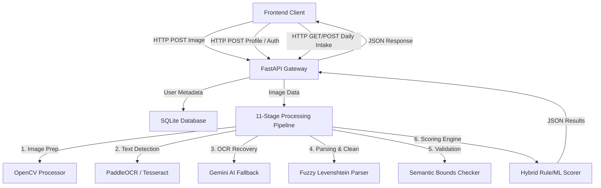

# System Architecture & Technical Specifications Report
## NutriScan - Easy Nutrition Label Analyzer (Version 3.0 Stable)

NutriScan is a full-stack, AI-powered food safety and personalized nutrition analytics platform. It enables users to upload photos of food packaging, extracts raw nutritional information via advanced computer vision, rates the product's health alignment using machine learning, and logs daily intake with profile-specific limits.

---

## 1. System Topology Overview

The application utilizes a modular, decoupled architecture consisting of three primary layers:
1. **Presentation Layer (Frontend)**: A modern HTML5/CSS3 single-page application focused on high readability, senior-friendly light typography, rotating background slideshow overlays, and interactive progress widgets.
2. **REST API Gateway (Backend)**: Built with FastAPI (Python 3.10+), providing fast asynchronous endpoints for image upload, user state sync, profile settings, and meal logging.
3. **Intelligence & Processing Pipeline (Core)**: A linear, multi-stage computer vision and machine learning engine that transforms raw raster images into validated JSON data.



---

## 2. The 11-Stage Intelligence Pipeline

When a food label image is submitted to `/analyze`, it is routed through a sequential pipeline designed to guarantee high accuracy, error correction, and personalization.

```
[Raw Image] ➔ Stage 1: File Input ➔ Stage 2: OpenCV Filter ➔ Stage 2.5: Vision AI ➔ Stage 3: OCR Detection
    ➔ Stage 4: Confidence Check ➔ Stage 5: Crop Recovery ➔ Stage 6: Text Merging ➔ Stage 7/8: Fuzzy Parsing
    ➔ Stage 9: Bounds Check ➔ Stage 10: Hybrid Scorer ➔ Stage 11: Insight Generation ➔ [Validated Analysis]
```

### Stage 1: Image Input & Verification
- **Technique**: Input sanitization and format verification.
- **Tools**: `opencv-python`, `Pillow`.
- **Details**: Validates headers, sizes, and orientations. Generates a unique UUID `image_id` for tracking.

### Stage 2: Image Enhancement & Preprocessing
- **Technique**: Grayscale translation, Otsu's thresholding, Lanczos4 downscaling, and sharpening filters.
- **Details**: Normalizes contrast variations, shadows, and low-light distortions to maximize OCR character clarity.

### Stage 2.5: AI Primary Extraction (Fast Path)
- **Technique**: Multimodal LLM Direct Prompting.
- **Tools**: Google Gemini API (`gemini-2.5-flash`).
- **Details**: Attempts to query the multimodal API directly with the image for structured nutrition extraction. If successful, skips local text preprocessing, achieving high precision. If rate-limited or offline, falls back gracefully to Stage 3.

### Stage 3: Hybrid OCR Text Detection
- **Technique**: Layout analysis and word bounding box extraction.
- **Tools**: `PaddleOCR` (PP-OCRv5) with `Tesseract OCR` fallback.
- **Details**: Extracts bounding boxes, texts, and confidence percentages. Runs locally on CPU.

### Stage 4: OCR Confidence Evaluation
- **Technique**: Mathematical mean evaluation of bounding box confidence factors.
- **Details**: If the average confidence score falls below **95%**, the system automatically triggers Stage 5 (OCR Recovery).

### Stage 5: OCR Recovery & Crop Refinement
- **Technique**: Semantic image slicing and local text reconstruction.
- **Details**: Crops low-confidence lines and submits individual slices to the Gemini API for isolated character recognition. Avoids global image degradation.

### Stage 6: Layout-Preserving Text Merging
- **Technique**: Grid sorting and line-segment matching algorithms.
- **Details**: Groups text bounding boxes by coordinate grids ($y$-axis alignment) to recreate lines like `Total Fat   8.0g   12%` as contiguous text streams.

### Stage 7 & 8: Fuzzy Synonym Parser
- **Technique**: Levenshtein Distance ($D_L \ge 0.90$) and regex synonym maps.
- **Details**: Maps OCR anomalies (e.g. `Sodlum 1O0mg` ➔ `sodium_mg: 100`). Standardizes units (e.g., converts kilojoules `kJ` to `kcal` and salt weight to `sodium_mg` equivalents). Corrects "9-as-g" anomalies where trailing `g` characters are read as `9`.

### Stage 9: Semantic Bounds Validator
- **Technique**: Macronutrient mathematical cross-checking.
- **Details**: Ensures sum of fats, proteins, and carbohydrates does not exceed the serving size, and validates that calorie counts align with at-least-approximate calorie values (e.g. $\text{Fat} \times 9 + \text{Protein} \times 4 + \text{Carbs} \times 4 \approx \text{Energy}$). Autocorrects logical errors.

### Stage 10: Hybrid Health Scoring Engine
- **Technique**: Blended Model: 40% Rule-Based Scorer + 60% Stacked Ensemble ML Model.
- **Tools**: `scikit-learn`, `pickle`, `xgboost`.
- **Ensemble Models**: Stacked Random Forest Classifier + Gradient Boosting Classifier + XGBoost Meta-Estimator.
- **Details**: Extracts features like energy density and nutrient completeness. If the compiled ensemble model `health_model.pkl` is missing, it falls back to 100% rule-based scoring.

### Stage 11: Dynamic Personalization & Insight Generation
- **Technique**: Health profile deductions and daily budget calculations.
- **Details**: Personalizes scores and flags warnings based on user choices and today's cumulative intake:
  - **Exceeded Daily Budget**: If a user is already over their daily limit, any addition of that nutrient applies a high-risk penalty to the product score.
  - **Allergen/Vegan Flags**: Warns of cholesterol in vegan diets, sugars in diabetic profiles, and high sodium for hypertensive users.

---

## 3. Database Architecture (SQLite)

The local data layer is managed via a transactional SQLite database located at `data/users.db`. 

### A. Users Table (`users`)
Stores user profiles and health goals.
```sql
CREATE TABLE users (
    email TEXT PRIMARY KEY,
    name TEXT,
    is_diabetic BOOLEAN DEFAULT 0,
    has_high_bp BOOLEAN DEFAULT 0,
    heart_condition BOOLEAN DEFAULT 0,
    weight_loss_goal BOOLEAN DEFAULT 0,
    is_vegan BOOLEAN DEFAULT 0
);
```

### B. Daily Intake Table (`daily_intake`)
Stores food logs, tracking daily nutrient budgets.
```sql
CREATE TABLE daily_intake (
    id INTEGER PRIMARY KEY AUTOINCREMENT,
    email TEXT NOT NULL,
    date TEXT NOT NULL,          -- Format: YYYY-MM-DD
    product_name TEXT NOT NULL,
    energy_kcal REAL DEFAULT 0,
    sugars_g REAL DEFAULT 0,
    sodium_mg REAL DEFAULT 0,
    saturated_fat_g REAL DEFAULT 0,
    protein_g REAL DEFAULT 0,
    carbohydrates_g REAL DEFAULT 0,
    fat_g REAL DEFAULT 0,
    timestamp TEXT NOT NULL,     -- ISO-8601 UTC format
    FOREIGN KEY(email) REFERENCES users(email)
);
```

---

## 4. Custom Nutrient Limits & Suggestions

NutriScan adjusts daily allowances according to the user's health profile:

| Nutrient | Standard Daily Limit | Diabetic Limit | High BP / Heart Limit | Weight Loss Limit |
|---|---|---|---|---|
| **Calories** | 2000 kcal | 2000 kcal | 2000 kcal | **1600 kcal** |
| **Sugar** | 50g | **25g** | 50g | 50g |
| **Sodium** | 2000mg | 2000mg | **1500mg** | 2000mg |
| **Saturated Fat**| 20g | 20g | **13g** (Heart) | 20g |

### Dynamic Dietitian Recommendations
- **Sugar $> 80\%$ limit**: *"⚠️ Sugar limit almost reached or exceeded. Avoid juices, sodas, chocolates, and sweets."*
- **Sodium $> 80\%$ limit**: *"⚠️ Sodium limit almost reached or exceeded. Avoid salty chips, soy sauce, processed meats, and canned soups."*
- **Saturated Fat $> 80\%$ limit**: *"⚠️ Saturated Fat limit almost reached or exceeded. Avoid fried foods, heavy cream, butter, and red meat."*
- **Calories $> 90\%$ limit**: *"⚠️ Calorie limit almost reached. Focus on light salads or low-calorie snacks if you need to eat."*

---

## 5. UI/UX Design System

The frontend is designed with accessibility and aesthetics in mind, deviating from computer-science-style dark themes to offer an inviting health-app interface.

### Key Visual Elements
1. **Organic Color Palette**:
   - Primary: `#2e7d32` (organic forest green)
   - Secondary: `#4caf50` (fresh mint green)
   - Accent: `#fb8c00` (citrus orange / vitamin C)
   - Warning: `#c62828` (red)
   - Light Background: `#f6f8f5` (warm pale grey/sage)
2. **Rotating Background Overlays**:
   - Smoothly cycles through 3 high-contrast, project-related images (fresh fruits flat lay, healthy meal, grocery shopping label) at a 18% opacity every 8 seconds, ensuring text remains sharp and highly legible.
3. **Typography**:
   - Primary heading font is **Outfit** for clean modern layouts.
   - Body font is **Inter** for excellent character legibility.
4. **Log Book Interface**:
   - Contains clean, modern circular rings or grid progress bars representing daily calorie/macronutrient allowances. Colors transitions to yellow/red on nearing caps.

---

## 6. Development Tools & Technologies

- **Programming Language**: `Python 3.10`
- **Web Framework**: `FastAPI` (REST API layer)
- **ASGI Server**: `Uvicorn`
- **Computer Vision**: `OpenCV (cv2)`, `PaddleOCR (PP-OCRv5)`, `Tesseract OCR`
- **Machine Learning**: `scikit-learn` (Ensemble classifiers), `xgboost` (Meta-estimator)
- **Database**: `SQLite3`
- **Frontend Architecture**: HTML5, Vanilla JavaScript, CSS3
- **Google Cloud Suite**: Firebase Auth (Google OAuth2.0), Gemini API (structured recovery & fallback OCR)
- **Version Control**: `Git`
- **Containerization**: `Dockerfile` (ready for cloud deploy)

---
**Report Status: Release v3.0 Stable // Production Ready**
**Author: Antigravity AI Engineering**
